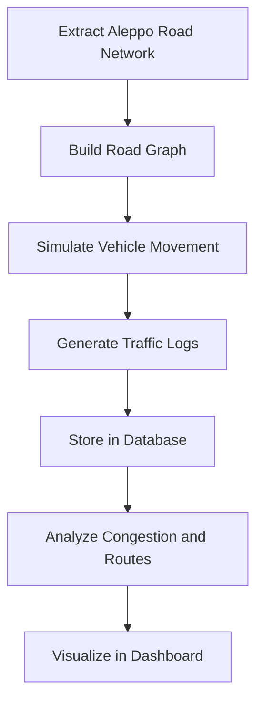

# Syria Smart Mobility Pipeline

A data engineering project to simulate, analyze, and visualize urban traffic in Aleppo, Syria — enabling smart reconstruction, humanitarian aid optimization, and urban mobility insights in post-conflict zones where real-time data is unavailable.

---

## 📌 Project Overview

**Syria Smart Mobility Pipeline** builds a simulation-based system to provide traffic and congestion insights in Aleppo using open-source geospatial data. The pipeline models realistic vehicle flows, identifies bottlenecks, and visualizes results on an interactive map — serving as a decision-support tool for urban planners, NGOs, and researchers.

---

## 🧭 Key Features

- 🗺️ **OpenStreetMap Integration** – Extract Aleppo's road network using `osmnx`
- 🔁 **Vehicle Movement Simulation** – Model vehicle routing and flow on the road graph
- 🛢️ **Traffic Data Generation** – Generate synthetic logs of traffic activity
- 📊 **Congestion Analysis** – Detect hotspots, average travel times, and routing bottlenecks
- 🖥️ **Interactive Dashboard** – Visualize traffic patterns using `folium` and `streamlit`
- ⚙️ **Modular Pipeline** – Easily scalable to other Syrian cities or future real sensor data

---

## 🌍 Use Case Relevance

In Syria's post-war environment, real-time traffic and infrastructure data are scarce. This pipeline helps:

- 🏛️ Government agencies plan reconstruction by identifying high-congestion zones
- 🤝 NGOs optimize humanitarian aid delivery routes in cities like Aleppo
- 📚 Researchers understand urban mobility patterns and infrastructure degradation

---

## 🧱 System Architecture



---

## 🛠️ Tech Stack

| Layer            | Tool                                                                                            |
| ---------------- | ----------------------------------------------------------------------------------------------- |
| Map Data         | [OpenStreetMap](https://www.openstreetmap.org/) via [`osmnx`](https://github.com/gboeing/osmnx) |
| Graph & Routing  | `networkx`                                                                                      |
| Simulation Logic | Custom Python                                                                                   |
| Data Handling    | `pandas`, `geopandas`                                                                           |
| Database         | `PostgreSQL` (scalable)                                                                         |
| Visualization    | `folium`, `streamlit`                                                                           |

---

## 🚀 Getting Started (To be added)

> 🚧 _Installation and usage instructions will be added as development begins._

---

## 📁 Project Structure (Planned)

```
syria-mobility-pipeline/
│
├── data/                    # Processed or raw OSM & traffic data
├── notebooks/              # Jupyter notebooks for exploration
├── src/                    # Main source code
│   ├── extractor/          # Map and network extraction
│   ├── simulator/          # Vehicle simulation logic
│   ├── analyzer/           # Congestion & route analysis
│   └── visualizer/         # Dashboard and map views
├── dashboard/              # Streamlit app
├── requirements.txt        # Python dependencies
└── README.md               # This file
```

---

## 🧩 Future Improvements

- Add realistic data feeds (e.g., satellite imagery, IoT sensors)
    
- Support multiple Syrian cities
    
- Introduce ML models for travel time prediction
    
- Deploy dashboard to the cloud (e.g., Streamlit Cloud, AWS)
    

---

## 🧑‍💻 Author

**Mahmoud Kebbi**  
Final Year Project — Computer Engineering  
Lebanese American University

---

## 📜 License

This project is open-source under the **MIT License**.
